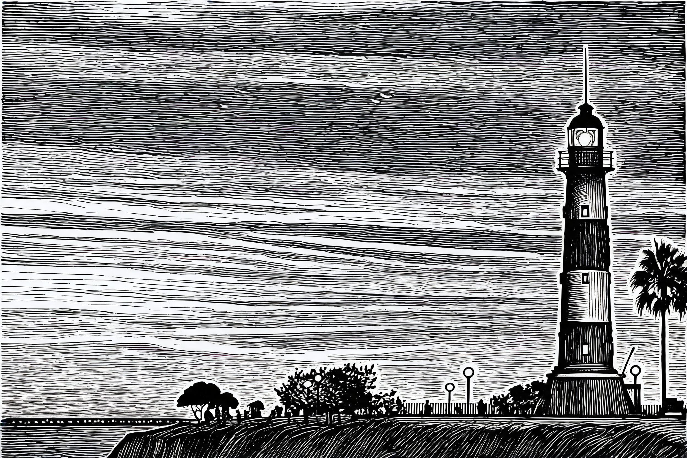
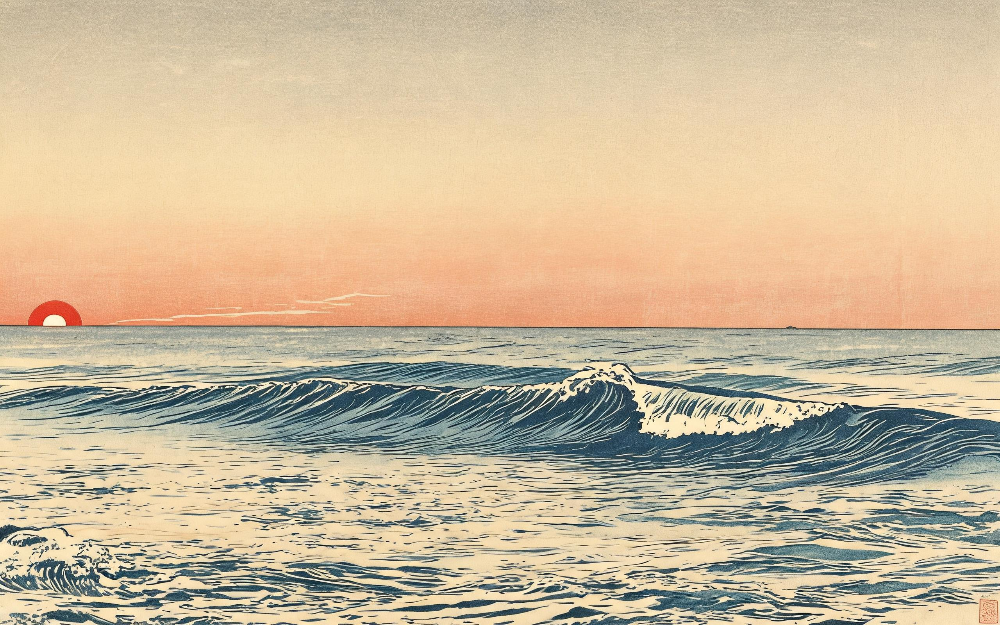

# 照片印坊 · Photo Press

把一张照片送进印坊，选一种真实印刷工艺，印成一件印刷品。**风格不是滤镜，是工艺。**

给一张照片 + 一个风格词（"复古"、"清新"、"波普"……或直接说工艺名），按真实印刷工艺（木刻 / 浮世绘 / 水彩 / 撕纸 / 活字 / 孔版 / 丝网 / 剪纸 / 暗房 / 蓝晒 / 水墨 / 极简）的工序还原成海报——主体保持可辨认，抽象来自工艺而非滤镜关键词。

## 真实效果（源图 → 工艺成品，seedream 实测）

| 木刻 · Woodcut | 水彩 · Watercolor |
|----------------|-------------------|
|  |  |
|  |  |

| 浮世绘 · Ukiyo-e | 蓝晒 · Cyanotype |
|------------------|------------------|
|  |  |
|  |  |

> 全部 13 组案例（source + result + 返检记录）见 [`examples/`](examples/)。测试数据与可执行回归见 [`tests/`](tests/)。

## 验证状态（72 张全量测试，seedream 通道，2026-08-25 实测）

指标：边缘相关性（<0.4 视为保真失败）；视觉模型逐张审查。**原始矩阵可复核：`tests/72-matrix/matrix.csv`。**

| 工艺 | 平均相关 | 失败率 | 视觉判定 | 保真上限 |
|------|---------|--------|---------|---------|
| 暗房 silver | 0.73 | 0% | 6/6 ✅ | 摄影工艺保真天然最高 |
| 蓝晒 cyanotype | 0.73 | 0% | 6/6 ✅ | 同摄影工艺族 |
| 水彩 watercolor | 0.63 | 0% | 6/6 ✅ | 稳定 |
| 孔版 risograph | 0.60 | 0% | 5/6 ❌ 花 | 稳定 |
| 丝网 silkscreen | 0.58 | 17% | 6/6 ✅ | 黑白源略弱 |
| 浮世绘 ukiyo-e | 0.55 | 0% | 5/6 ❌ 花 | 风景/建筑 |
| 水墨 ink-wash | 0.54 | 17% | 6/6 ✅ | 花/复杂主体较弱 |
| 撕纸 torn-paper | 0.54 | 0% | 6/6 ✅ | 稳定 |
| 木刻 woodcut | 0.50 | 33% | 6/6 ✅ | 剪影级细节，渐变天空难消除 |
| 极简 minimalist | 0.45 | 50% | 6/6 ✅ | 复杂背景主体需降 strength |
| 剪纸 paper-cut | 0.41 | 33% | 5/6 ❌ 花 | 细节被镂空破坏 |
| 活字 letterpress | 0.53（修复后） | 17% | 6/6 ✅ | 默认 no-text（强制加字曾致 83% 失败） |

**主体难度**：黑白人像失败率 42% ＞ 彩色花 33% ＞ 日出剪影 17% ＞ 灯塔/浪/城市 8%。人像走摄影工艺，花主体避开硬边工艺。

## 快捷开始

1. 把 `photo-press-v1/` 目录复制到 `~/.claude/skills/`（或 `~/.config/opencode/skills/`）。
2. 给 agent 一张照片 + 一个风格词：**"把这张照片做成木刻海报"** / **"复古风"** / **"波普一点"**。
3. 预期行为：三问读图 → 按风格词路由到工艺 → 双通道生成 → 对照源图返检，输出一张可辨认主体的工艺海报。
4. 需要能"以参考图编辑"的生图通道（seedream 实测可用）；不支持参考图的通道会明确告知并走程序化保真兜底。

## 核心机制

- **三问读图**：是什么 / 为什么值得 / 怎么做。第二问答不出，就不生成。
- **保真契约**：PRESERVE / MAY TRANSFORM / REMOVE 三分类清单。
- **保真上限由工艺决定**：木刻保不了细节，是工艺选错了，越界先换工艺不硬调。
- **双通道参考**：原图（内容通道）+ 工艺样张（质感通道，boring anchor）。
- **模型无关**：通道能力检查把保真旋钮映射到任意生图模型（seedream ✅ 实测；gpt-image / Midjourney / SD-Flux ⚠️ 未实测）。
- **实测驱动**：72 张全量测试 + 视觉模型审查，工艺参数（strength 甜点、保真上限、适用限制）都有可复核数据（`tests/`）。

## 灵感来源

- [Zeejay0/gathered-scenes-zine-skill](https://github.com/Zeejay0/gathered-scenes-zine-skill)（意象提取 / 语义最小集方法，MIT）
- 同类参考：[jas0nh/zine-poster-skill](https://github.com/jas0nh/zine-poster-skill)、[LiamGvchi/gc-minimal-zine-poster](https://github.com/LiamGvchi/gc-minimal-zine-poster)

## 许可

[MIT](LICENSE)
