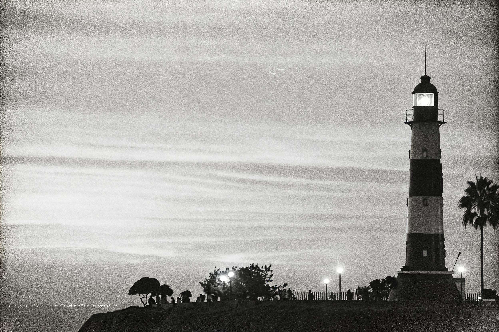

# 灯塔暗房 · Lighthouse Darkroom

**工艺：暗房银盐（darkroom）**
**Skill：`photo-press-v1`**
**通道：Agent Plan doubao-seedream-5.0-lite（图生图，reference_strength=0.9，中文直白保真锚定模板）**

| 原始照片 | 最终作品 |
| :---: | :---: |
|  |  |

## 三问读图

- **是什么**：黄昏中的灯塔，塔与树立在天光下。
- **为什么值得**：一座塔立住整片天空的孤独。
- **怎么做**：暗房——黑白银盐把黄昏的紫调收进灰度，颗粒替色彩。

## 保真契约

- **PRESERVE**：灯塔形状、位置、大小、地平线、整体布局。
- **MAY TRANSFORM**：色彩（转黑白灰阶）、明暗（影调重排）。
- **保真旋钮**：3（紧）→ reference_strength 0.9。

## 返检结果

| 指标 | 数值 | 判定 |
|------|------|------|
| 边缘结构相似度 | 0.886 | ✅ 全部案例最高级 |
| 边缘相关性 | 0.893 | ✅ |
| 饱和度 | 0.45 → 0.031 | ✅ 银盐黑白化达成 |

- 说明：暗房是摄影工艺族（与蓝晒同族），保真天然高——本案例边缘相关性 0.893 为全部 examples 之最。银盐颗粒与影调层次到位。这也对应风格词路由里"复古 / 老照片 / 胶片"的常见需求。

> 黄昏的紫被收进灰度，颗粒替色彩说话。

---
源照片：Wikimedia Commons [Cape May Lighthouse September 2020 002.jpg](https://commons.wikimedia.org/wiki/File:Cape_May_Lighthouse_September_2020_002.jpg)
