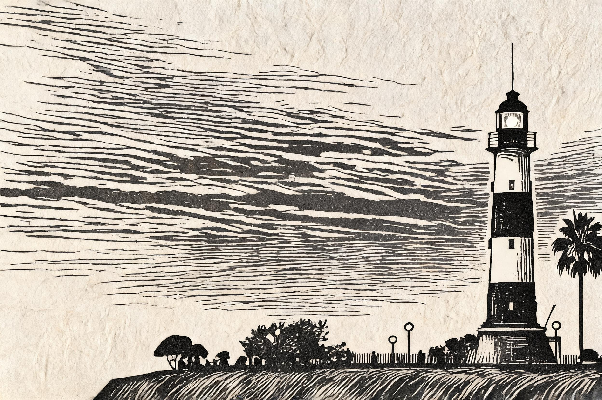

# 灯塔活字 · Lighthouse Letterpress

**工艺：活字凸版印刷（letterpress）**
**Skill：`photo-press-v1`**
**通道：Agent Plan doubao-seedream-5.0-lite（图生图，reference_strength=0.9，双参考：源图 + 活字工艺 anchor）**

| 原始照片 | 最终作品 |
| :---: | :---: |
|  |  |

## 三问读图

- **是什么**：黄昏逆光剪影的黑白横条纹灯塔立于画面右侧，极低地平线，天空紫粉渐变占 2/3，崖顶有人物与棕榈树剪影。
- **为什么值得**：人造光（航标灯、路灯）穿透暮色黑暗——"孤立的光"。
- **怎么做**：活字凸版把主体压成版画化剪影，天空留出标题带，压印凹痕收住画面。

## 保真契约

- **PRESERVE**：灯塔条纹塔身与航标灯、位置与比例、极低地平线、逆光剪影、紫粉天空。
- **MAY TRANSFORM**：云、人物、棕榈树（合并为大形与排线）。
- **保真旋钮**：3（紧）；抽象旋钮 2。
- **参数**：strength 0.9；单色油墨 + 纸色；默认 no-text，主体上方留标题带。

## 返检结果

- 6 维评分矩阵（主体/空间/光线/工艺/色彩/文字杂物）：**5/5/4/5/4/5**，verdict pass。
- 工艺质检 4/4：主体可识别（未被当文字整行排掉）✓、压印凹痕质感在 ✓、单色/双色 ✓、无凭空文字 ✓。
- 候选择优：v2（无标题带纯影像版）工艺质感不足被淘汰；本图与 v3（深墨单色版）并列最高分，选经典单色。

> 塔身被压进纸里，标题带空着，留给海风。
