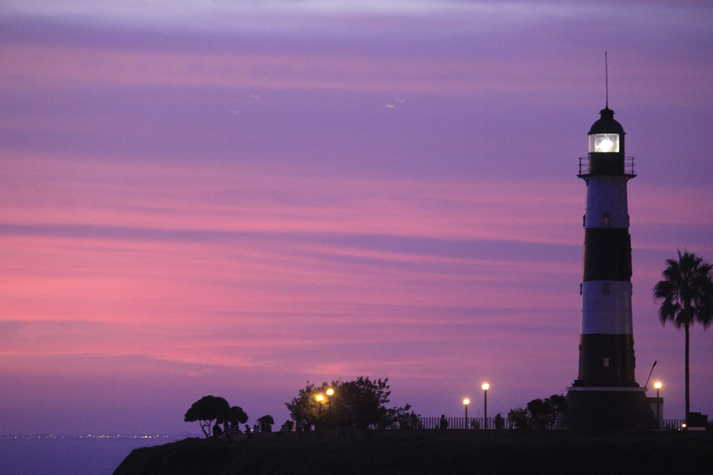
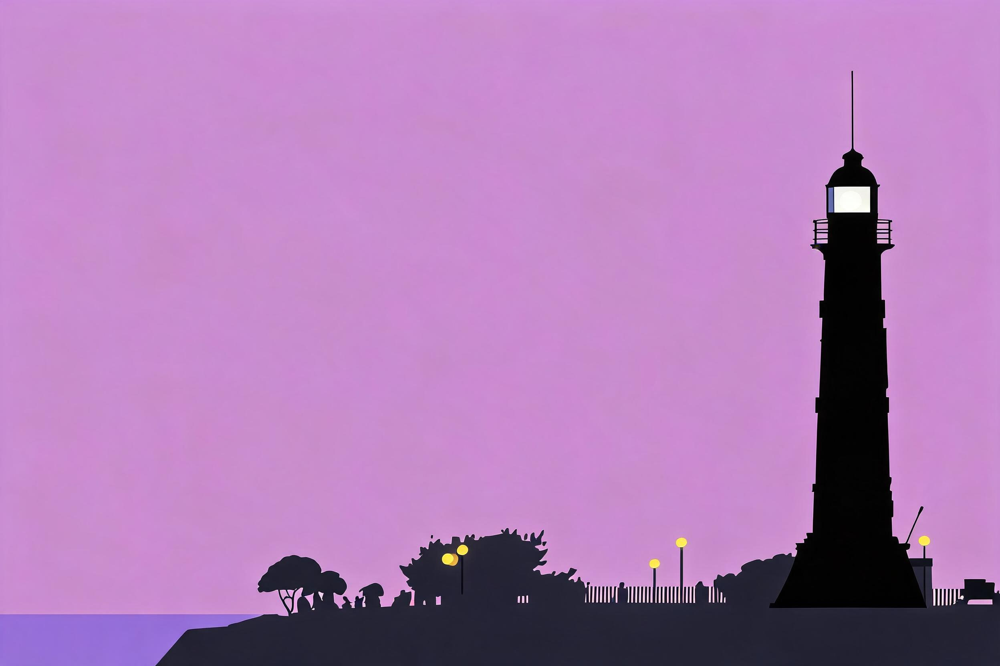

# 灯塔极简 · Lighthouse Minimal

**风格：极简（minimalist，现代设计风格，非印刷工艺）**
**Skill：`photo-press-v1`**
**通道：Agent Plan doubao-seedream-5.0-lite（图生图，reference_strength=0.7，中文直白保真锚定模板）**

| 原始照片 | 最终作品 |
| :---: | :---: |
|  |  |

## 三问读图

- **是什么**：黄昏中的灯塔，塔与树立在天光下。
- **为什么值得**：一座塔立住整片天空的孤独。
- **怎么做**：极简——把黄昏压成一块底色，塔只留剪影。

## 保真契约

- **PRESERVE**：灯塔剪影轮廓、位置、大小、地平线。
- **MAY TRANSFORM**：背景（合并为单一色块）、塔身细节（去除）、色彩（凝练为 2-4 种主色）。
- **保真旋钮**：2（标准）→ reference_strength **0.7**（极简是减法风格，实测甜点为 0.7——过高的保真强度会压住"去除细节"；这与印刷工艺的 0.9 甜点不同）。

## 返检结果

| 指标 | 数值 | 判定 |
|------|------|------|
| 主体轮廓（边缘相关性） | 0.817 | ✅ 剪影高度保留 |
| 主色保留（色相命中） | 0.67 | ✅ 保留黄昏主调 |
| 背景单色化（top1 色占比） | 0.677 | ✅ 背景已合并为单一色块 |

- 说明：本案例验证了极简工艺的两个关键规则——① **不指定色名**：指定"天蓝/塔白"会让模型执行字面色块、覆盖源图主色（实测主色命中降到 0.0）；改为"从原图提取 2-4 种主色"后主色命中回到 0.67。② **strength 降档**：0.9 时背景合并不动（单色化 0.348），0.7 时合并成功（单色化 0.677）且保真反而最高（0.817）。

> 黄昏被压成一块底色，塔留下剪影。

---
源照片：Wikimedia Commons [Cape May Lighthouse September 2020 002.jpg](https://commons.wikimedia.org/wiki/File:Cape_May_Lighthouse_September_2020_002.jpg)
