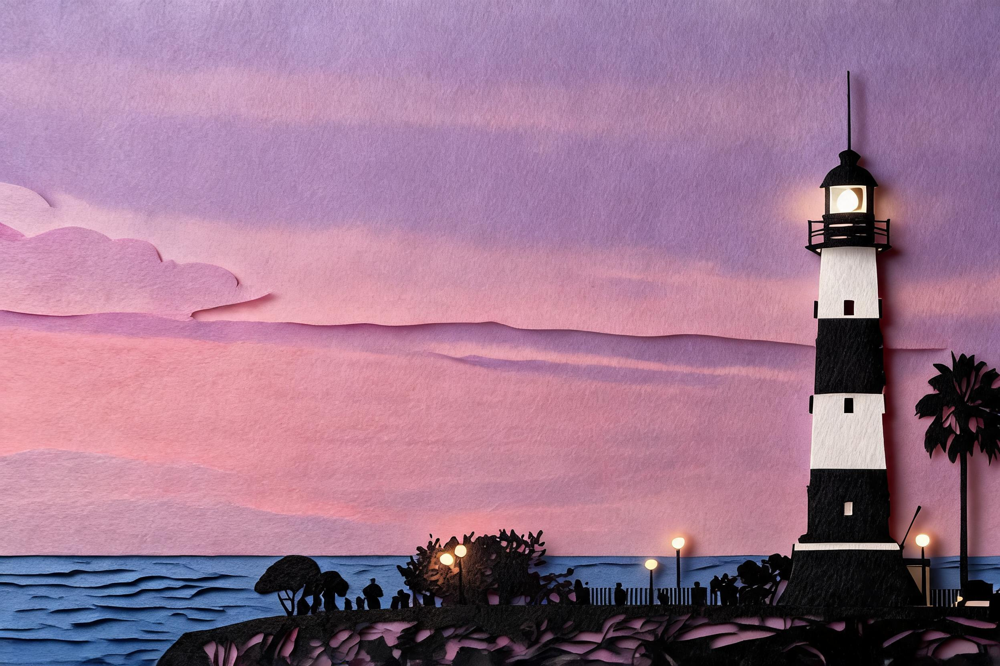

# 灯塔剪纸 · Lighthouse Paper Cut

**工艺：剪纸层叠（paper-cut）**
**Skill：`photo-press-v1`**
**通道：Agent Plan doubao-seedream-5.0-lite（图生图，reference_strength=0.9，双参考：源图 + 剪纸工艺 anchor）**

| 原始照片 | 最终作品 |
| :---: | :---: |
|  |  |

## 三问读图

- **是什么**：黄昏逆光剪影的黑白横条纹灯塔立于画面右侧，极低地平线，天空紫粉渐变占 2/3，崖顶有人物与棕榈树剪影。
- **为什么值得**：人造光（航标灯、路灯）穿透暮色黑暗——"孤立的光"。
- **怎么做**：剪纸层叠用 3 层纸片把画面立起来，层间投影制造纵深。

## 保真契约

- **PRESERVE**：灯塔条纹塔身与航标灯、位置与比例、极低地平线、逆光剪影、紫粉天空。
- **MAY TRANSFORM**：云、人物、棕榈树（合并为层形）。
- **保真旋钮**：3（紧）；抽象旋钮 2。
- **参数**：strength 0.9；3 层纸色（前景深 / 中景主体 / 背景浅轮廓），层间投影明显。

## 返检结果

- 6 维评分矩阵（主体/空间/光线/工艺/色彩/文字杂物）：**5/4/4/5/4/5**，verdict pass。
- 工艺质检 4/4：层数 2-4 层 ✓、层间投影在（深度感）✓、前景层最暗 ✓、未变成逐片碎片堆叠 ✓。
- 候选择优：v1 层数超标且碎片堆叠、v3 层数问题，均被工艺质检淘汰；本图（强调层间投影）是唯一全过版本。

> 塔被剪成三层纸，影子垫在下面，海风穿不过去。
