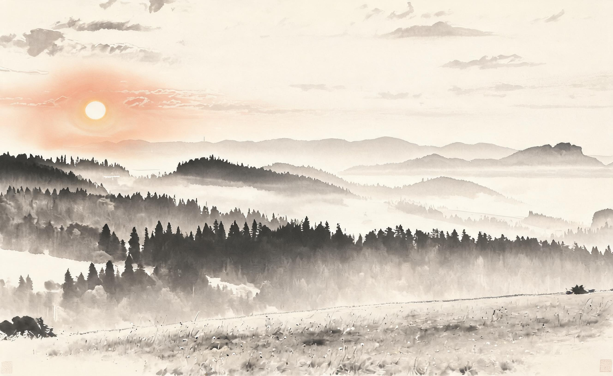

# 日出水墨 · Sunrise Ink Wash

**工艺：水墨（ink-wash）**
**Skill：`photo-press-v1`**
**通道：Agent Plan doubao-seedream-5.0-lite（图生图，reference_strength=0.9，中文直白保真锚定模板）**

| 原始照片 | 最终作品 |
| :---: | :---: |
|  |  |

## 三问读图

- **是什么**：日出时的山脉、河流与天空。
- **为什么值得**：晨曦的静，光刚从山后起来。
- **怎么做**：水墨——墨色浓淡替光线，留白替雾。

## 保真契约

- **PRESERVE**：山脉剪影、河流走向、天空位置。
- **MAY TRANSFORM**：色彩（转墨色）、细节（笔意概括）。
- **保真旋钮**：2（标准）→ reference_strength 0.9。

## 返检结果

| 指标 | 数值 | 判定 |
|------|------|------|
| 饱和度 | 0.347 → 0.108 | ✅ 墨色化达成 |
| 边缘结构相似度 | 0.680 | ✅ 结构高度保留 |
| 边缘相关性 | 0.571 | ✅ |

- 说明：水墨以墨色浓淡与留白转译光线，与"水彩"同属水性工艺族，但走笔意与留白路线（水彩保留色彩，水墨归墨）。日出雾气与水墨的留白气质天然契合。

> 晨光被研成墨，山脉还在原处。

---
源照片：Wikimedia Commons [Sunrise in Pieniny, Poland 02.jpg](https://commons.wikimedia.org/wiki/File:Sunrise_in_Pieniny,_Poland_02.jpg)
