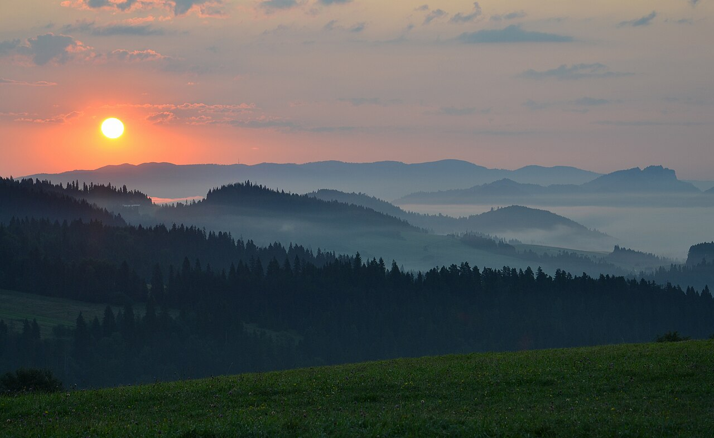
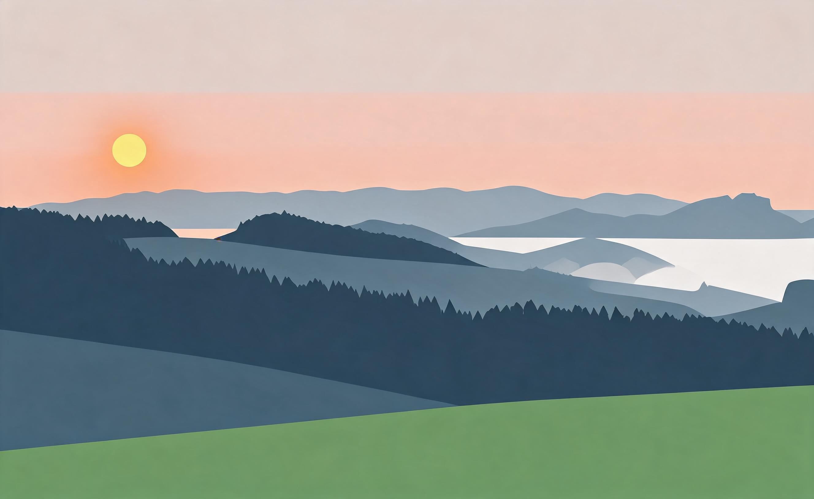

# 日出极简 · Sunrise Minimal

**风格：极简（minimalist，现代设计风格，非印刷工艺）**
**Skill：`photo-press-v1`**
**通道：Agent Plan doubao-seedream-5.0-lite（图生图，reference_strength=0.9，中文直白保真锚定模板）**

| 原始照片 | 最终作品 |
| :---: | :---: |
|  |  |

## 三问读图

- **是什么**：日出时的山脉、河流与天空。
- **为什么值得**：光刚从山后起来那一刻。
- **怎么做**：极简——山脉压成深色剪影，太阳留一个色块，天空留白。

## 保真契约

- **PRESERVE**：山脉剪影、河流走向、太阳位置。
- **MAY TRANSFORM**：天空（留白/纯色）、细节纹理（去除）。
- **保真旋钮**：2（标准）→ reference_strength 0.9。本主体天然极简（剪影型），高保真不减减法（高频能量降 0.44），与复杂背景的灯塔（需降到 0.7）不同。

## 返检结果

| 指标 | 数值 | 判定 |
|------|------|------|
| 主体轮廓（边缘相关性） | 0.701 | ✅ |
| 细节去除（高频能量比） | 0.438 | ✅ 减法是明显的 |
| 背景单色化（top1 色占比） | 0.378 | ✅ |

- 说明：日出是极简的理想主体——山脉本身就是剪影。对照灯塔案例：**剪影型主体（日出）strength 可保持 0.9；复杂背景主体（灯塔）需降到 0.7 让背景合并发生**。极简的强度调节应以"背景是否合并为单色"为准，而非统一值。

> 山脉沉成剪影，太阳留一块暖色。

---
源照片：Wikimedia Commons [Sunrise in Pieniny, Poland 02.jpg](https://commons.wikimedia.org/wiki/File:Sunrise_in_Pieniny,_Poland_02.jpg)
