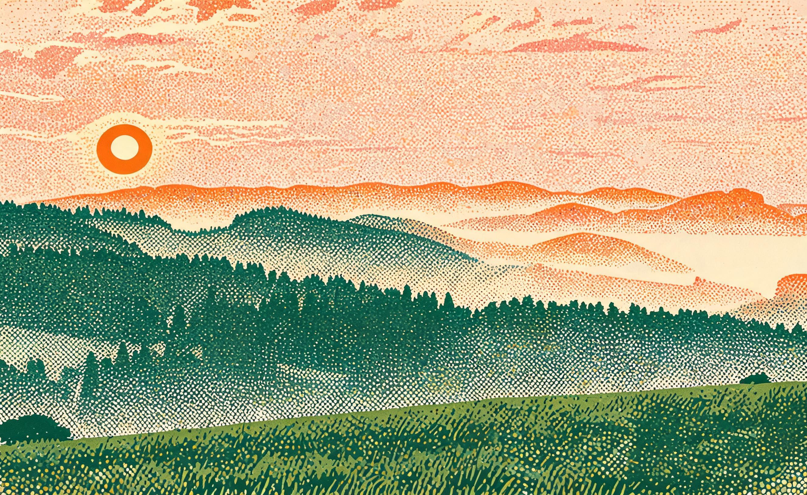

# 日出孔版 · Sunrise Risograph

**工艺：孔版速印（risograph）**
**Skill：`photo-press-v1`**
**通道：Agent Plan doubao-seedream-5.0-lite（图生图，reference_strength=0.9，双参考：源图 + 孔版工艺 anchor）**

| 原始照片 | 最终作品 |
| :---: | :---: |
|  |  |

## 三问读图

- **是什么**：日出俯瞰层叠山峦雾中森林，太阳在远山脊线上方左侧，低角度逆光，暖橙粉天空渐变，前景草甸。
- **为什么值得**：光穿过层叠雾气的冷暖对比，纵深被一层层拉开。
- **怎么做**：孔版速印把山峦分成 2-3 色平涂，套印错位与网点是印刷的呼吸。

## 保真契约

- **PRESERVE**：太阳位置与形态、层叠山峦纵向层次、低角度逆光、暖橙粉天空。
- **MAY TRANSFORM**：森林纹理、雾、草甸（合并为色块与网点层级）。
- **保真旋钮**：2（标准）；抽象旋钮 2。
- **参数**：strength 0.9；3 色平涂（暖橙 / 墨绿 / 浅米纸色），不渐变。

## 返检结果

- 6 维评分矩阵（主体/空间/光线/工艺/色彩/文字杂物）：**5/5/4/5/4/5**，verdict pass。
- 工艺质检 3/3：错位克制且来自套印 ✓、网点只在应出现区域 ✓、色数 2-3 色 ✓。
- 候选择优：v1 色数超标（>3 色）被工艺质检淘汰；v2/v3 均通过，选色数最规范的 3 色平涂版。

> 山是一层橙、一层绿，错位两毫米，是印刷在呼吸。
