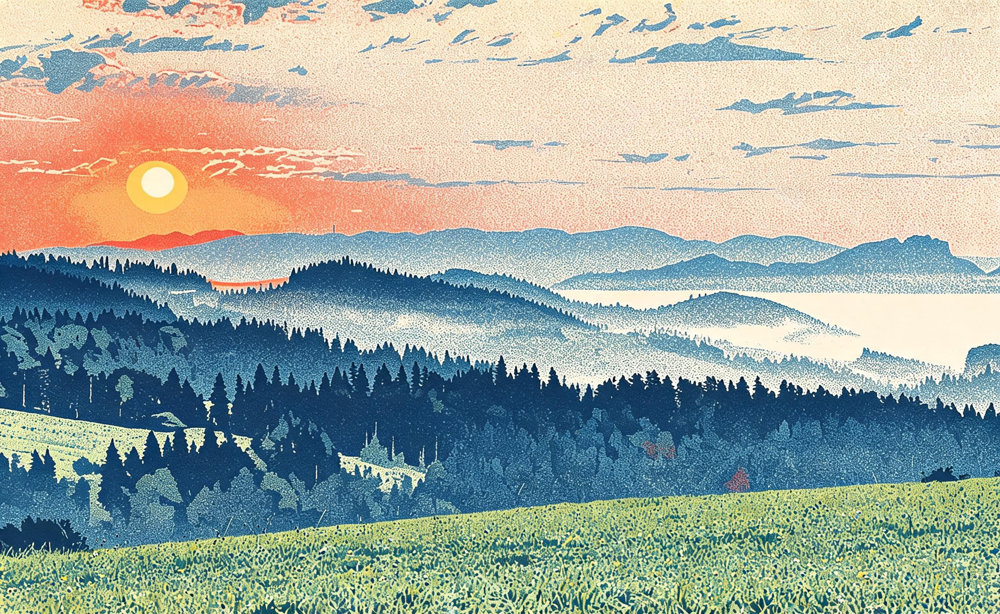

# 日出丝网 · Sunrise Silkscreen

**工艺：丝网版画（silkscreen）**
**Skill：`photo-press-v1`**
**通道：Agent Plan doubao-seedream-5.0-lite（图生图，reference_strength=0.9，中文直白保真锚定模板）**

| 原始照片 | 最终作品 |
| :---: | :---: |
|  |  |

## 三问读图

- **是什么**：日出时的山脉、河流与天空。
- **为什么值得**：霞光的色彩层次。
- **怎么做**：丝网——把霞光拆成 2-4 层硬边套色，波普式的撞色。

## 保真契约

- **PRESERVE**：山脉剪影、河流走向、太阳位置、整体布局。
- **MAY TRANSFORM**：色彩（套色化）、边缘（硬边色块）、天空渐变（色层）。
- **保真旋钮**：2（标准）→ reference_strength 0.9。

## 返检结果

| 指标 | 数值 | 判定 |
|------|------|------|
| 边缘结构相似度 | 0.516 | ✅ |
| 边缘相关性 | 0.457 | ✅（>0.4 警戒线） |
| 饱和度 | 0.347 → 0.358 | ✅ 撞色套色保留 |

- 说明：丝网是"硬边色块化"工艺，日出源图的霞光渐变被拆成硬边色层，边缘结构自然变化——0.457 是可接受的工艺转换结果，且色彩保留（饱和 0.358）。丝网对应风格词路由里"波普 / 海报 / 撞色"的需求。

> 霞光被拆成色层，撞色替渐变。

---
源照片：Wikimedia Commons [Sunrise in Pieniny, Poland 02.jpg](https://commons.wikimedia.org/wiki/File:Sunrise_in_Pieniny,_Poland_02.jpg)
